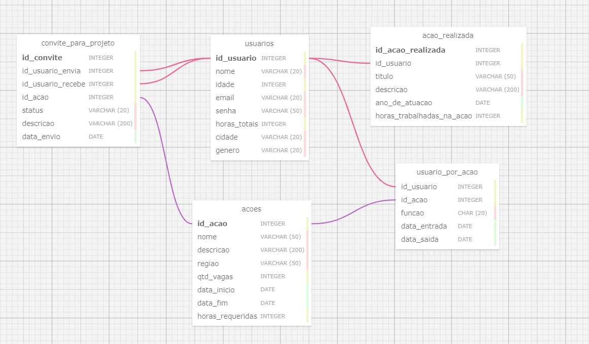

# Ponderada Semana 3: Modelagem de banco de dados relacionais
## Aluno: Caio de Alcantara Santos
### Turma 11 / Grupo 3

## Sumário

[1. O que é um banco de dados?](##1-o-que-é-um-banco-de-dados)

[2. Banco de dados desenvolvido](#2-banco-de-dados-desenvolvido)

[3. Conclusões](#3-conclusões)

[4. Referências](#4-referências)

## 1. O que é um banco de dados?

&nbsp;&nbsp;&nbsp;&nbsp;Um banco de dados é um tipo de sistema utilizado para armezar e gerenciar diversos tipos de dados e informações. Para este segundo módulo no Inteli, onde estamos construindo uma plataforma WEB, estamos utilizando um banco de dados relacionais, um modelo gerenciados de dados extremamente difundido no mundo.  
&nbsp;&nbsp;&nbsp;&nbsp;O modelo relacional é aquele onde os dados são guardados em tabelas, que são divididas em colunas e linhas, tal como uma planilha no Excel. Neste modelo, cada linha de uma tabela representa uma instância de um objeto, ou um registro.

### 1.1 Modelo Entidade Relacionamento

&nbsp;&nbsp;&nbsp;&nbsp;Ao se desenvolver um banco de dados, a primeira etapa é a sua modelagem, ou seja, a construção do modelo entidade-relacionamento e do modelo físico desse banco de dados. A modelagem é uma etapa muito importante do processo, pois é nela onde são definidas as tabelas que usaremos, quais dados pretendemos guardar, e como diferentes tabelas se relacionam entre si.  
&nbsp;&nbsp;&nbsp;&nbsp;Falando em relacionamentos, é aí que entra o modelo relacionamento entidade. Basicamente, tabelas podem se relacionar de maneiras diferentes. O relacionamento 1:n (um para muitos) indica que um registro de uma tabela pode se relacionar com muitos de outras tabelas. Já o relacionamento n:n indica que muitos registros de uma tabela se relacionam com muitos registros de outras tabelas.

#### 1.1.1 Modelo Entidade no nosso projeto:
&nbsp;&nbsp;&nbsp;&nbsp;O projeto que estamos desenvolvendo atualmente é uma plataforma web que tem o propósito de intermediar relações entre voluntários e organizações sociais, a fim de tornar mais fácil que representantes de organizações sociais encontrem voluntariado para as suas ações sociais. De acordo com isso e alguns requisitos feitos pelo parceiro, identificamos alguns pontos de relacionamentos entre tabelas no nosso banco de dados. Por exemplo, será necessário ter uma tabela para armazenar os usuários e outra para armazenar as ações sociais. Como um usuário pode estar em várias ações e uma ação pode ter vários usuários, este é um exemplo de relacionamento n:n. 

#### 1.1.2 Problemas com relacionamentos n:n:
&nbsp;&nbsp;&nbsp;&nbsp;Relacionamentos n:n trazem um grande problema para o nosso banco de dados. Caso nós simplesmente ligássemos as duas tabelas diretamente, esse tipo de relacionamento as faria crescer infinitamente, o que é muito ineficiente. Para remediar este problema, utilizamos de uma tática chamada de **normalização**, onde criamos uma tabela intermediária e que contém os "usuarios_por_projeto".

## 2. Banco de dados desenvolvido:

   
   Figura 1 - Banco de Dados 

    
   
   Fonte: Material produzido pelo autor (2024)
   

### 2.1 Tabelas:
&nbsp;&nbsp;&nbsp;&nbsp;A princípio, foram pensadas 5 tabelas que fossem capazes de satisfazer os requerimentos dos parceiros quanto as regras de negócio da plataforma web. São elas:
* usuarios: Tabela responsável por guardar os dados de qualquer usuário da plataforma, armazenando informações como nome, idade, email, senha, etc
* acoes: Tabela responsável por armazenar os dados de qualquer ação social cadastrada na plataforma, incluindo dados como nome, descrição, região de atuação, quantidade de vagas, etc
* acao_realizada: Esta tabela tem como intuito armazenar as ações sociais que um usuário em específico já participou, contendo informações como o ano de atuação e a quantidade de horas trabalhadas nesta ação em específico
* convite_para_projeto: Na nossa plataforma, gostaremos que um usuário possa convidar outro para uma ação. Assim, temos a tabela de convite que relaciona dois usuários (um que envia o convite e outro que recebe) e uma ação
* usuario_por_acao: Esta é a tal tabela de normalização que mencionei anteriormente. É por meio dela e apenas dela que as tabelas de usuários e ações se relacionam. Por meio da combinação das duas chaves primárias das tabelas principais, esta tabela consegue relacionar com eficiência quaisquer usuários que pertençam a quaisquer ações. 

### 2.2 Relações:
&nbsp;&nbsp;&nbsp;&nbsp;As relações nestas tabelas são ligeiramente simples. A única relação n:n que possuímos é a de usuários por projetos, e esta é "administrada" pela tabela intermediária usuario_por_acao. Além disso, temos a tabela de convite com 3 chaves estrangeiras, duas para usuários e uma para a ação em questão. Por fim, a tabela acao_relacioada estabelece um relacionamento 1:n, uma vez que um usuário pode registrar muitas ações. 

## 3. Conclusões
&nbsp;&nbsp;&nbsp;&nbsp;Por fim, você pode acessar e visualizar mais detalhadamente as tabelas e relacionamentos por meio do arquivo .xml presente neste repositório. Copie o conteúdo deste arquivo e cole-o no campo de input de xml no site <a href="https://sql.toad.cz/?keyword=online_library">SQL Designer</a>

## 4. Referências:
HARRINGTON, J. L. Relational database design and implementation : clearly explained. Amsterdam ; Boston: Morgan Kaufmann/Elsevier, 2009.

‌